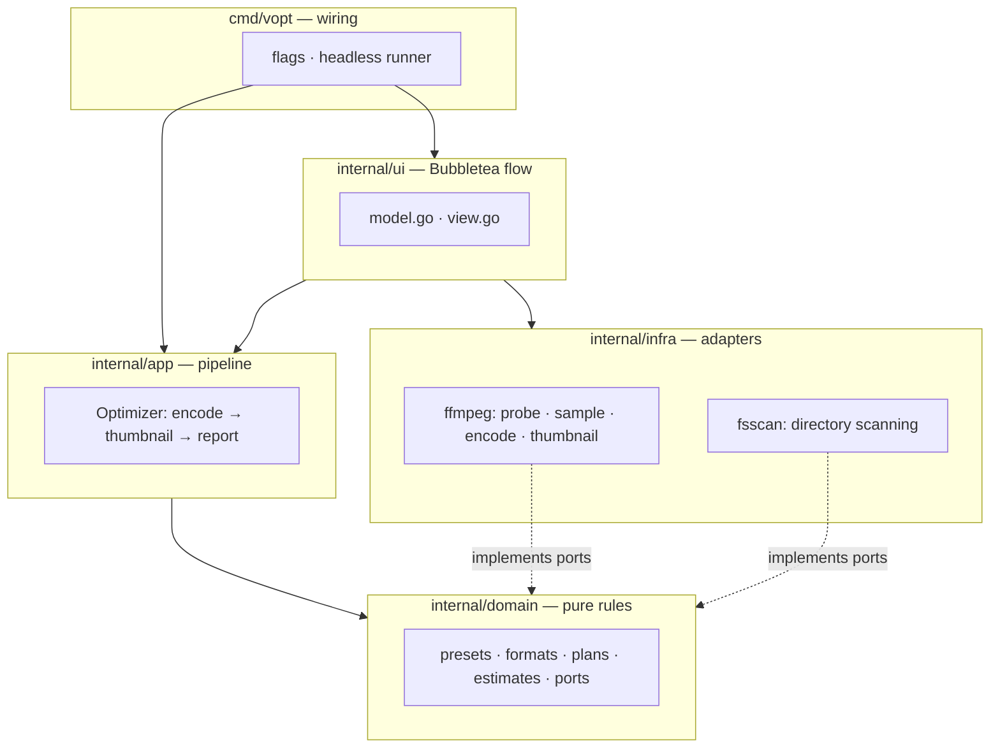
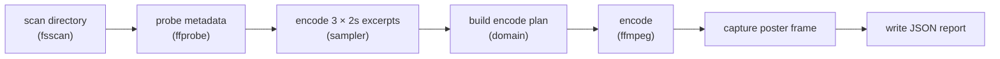

# Architecture

vopt follows a hexagonal layout: the compression rules live in a pure core
that never imports ffmpeg, Bubbletea, or the filesystem. The tools plug into
that core through small interfaces (ports), so every rule is testable without
a video file in sight.

## Layers

The dependency rule is one-directional: `domain` imports only the standard
library, `app` imports `domain`, adapters implement the interfaces `domain`
declares in [ports.go](../internal/domain/ports.go), and only `cmd/vopt`
knows about everything at once.

| Package | Role |
| --- | --- |
| `internal/domain` | Presets, formats, encode plans, size estimates, complexity model, ports |
| `internal/app` | The pipeline: run the encode, capture the poster frame, write the JSON report |
| `internal/infra/ffmpeg` | Adapters over `ffmpeg`/`ffprobe`: probing, sampling, encoding, thumbnails |
| `internal/infra/fsscan` | Finds candidate videos, skips the output directory |
| `internal/ui` | The interactive Bubbletea flow, theme, banner, frame preview |
| `internal/humanize` | Bytes, durations, bitrates and percentages for humans |
| `cmd/vopt` | Flag parsing, dependency wiring, headless (`-y`) runner |

## A run, end to end

1. **Scan** — `fsscan.Scanner` lists video files, excluding the output
   directory so runs stay idempotent.
2. **Probe** — `ffmpeg.Prober` reads duration, resolution and size via
   `ffprobe`.
3. **Sample** — `ffmpeg.Sampler` encodes three two-second excerpts at the
   selected settings and measures the real output bitrate. This is what makes
   the estimates honest: a static talking head and a handheld action shot
   answer the same CRF very differently.
4. **Plan** — `domain.BuildPlanWith` combines the video, the preset, the
   format and the measured complexity into an `EncodePlan`: CRF, bitrate
   ceiling, target resolution and a size estimate. `≈` means measured; `≤`
   means an upper bound (measurement skipped or failed).
5. **Encode** — `ffmpeg.Encoder` runs constrained-quality mode: it spends
   what the footage needs and never crosses the ceiling.
6. **Thumbnail** — `ffmpeg.ThumbGrabber` captures the poster frame at the
   chosen timestamp or percentage.
7. **Report** — `app.Optimizer` writes a JSON sidecar with what a web player
   needs: dimensions, duration, poster path and the size reduction.

## Two front ends, one pipeline

The interactive flow (`internal/ui`) and the headless runner (`-y`, in
`cmd/vopt/main.go`) drive the exact same `app.Optimizer`. Flags pre-answer
questions; the flow only asks what is still open. That keeps behaviour
identical between a scripted CI run and an interactive session.

## Extension points

- **New output format** — one entry in `domain.Formats`
  ([plan.go](../internal/domain/plan.go)) plus a case in `ffmpeg.BuildArgs`
  ([encoder.go](../internal/infra/ffmpeg/encoder.go)).
- **New preset** — one entry in `domain.Presets`.
- **New source of videos** — implement the scanner port and hand it to
  `ui.New`.
- **Different UI** — anything that can call `app.Optimizer.Run` with an
  `EncodePlan` is a valid front end; the headless runner is 150 lines.
